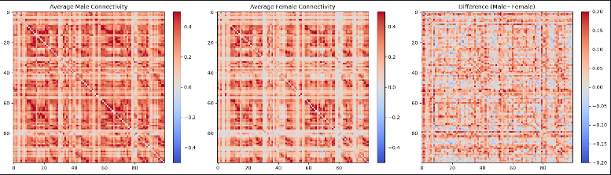
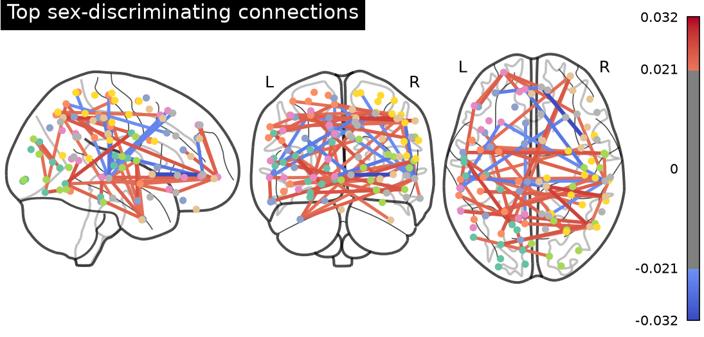

# Classifying Biological Sex from Resting-State Functional Connectivity

A machine-learning pipeline that predicts biological sex from resting-state
fMRI functional connectivity, built and validated on an open OCD dataset.

## Result
- **75% classification accuracy** — linear SVM, stratified 5-fold cross-validation (baseline ~51%)
- **Statistically significant** by permutation test (p = 0.003, 1000 label shuffles)
- Discriminative signal is **distributed brain-wide**, not localized — confirmed
  independently by network size-correction, a feature-count sweep, and connectome
  visualization

## Method
1. **Preprocess** raw resting-state fMRI — detrending, band-pass filter (0.01–0.08 Hz), standardization
2. **Parcellate** the brain into 100 regions using the Schaefer-100 atlas
3. **Compute functional connectivity** matrices → 4,950 connection features per subject
4. **Classify** with a linear SVM; validate with cross-validation and a permutation test
5. **Interpret** via SVM weights, mapped to functional networks and corrected for network size

## Data
Resting-state fMRI from an open OCD dataset on OpenNeuro: [add dataset link]
Data is not included in this repository (see `.gitignore`); download it from the link above.

## Figures

## Running it
